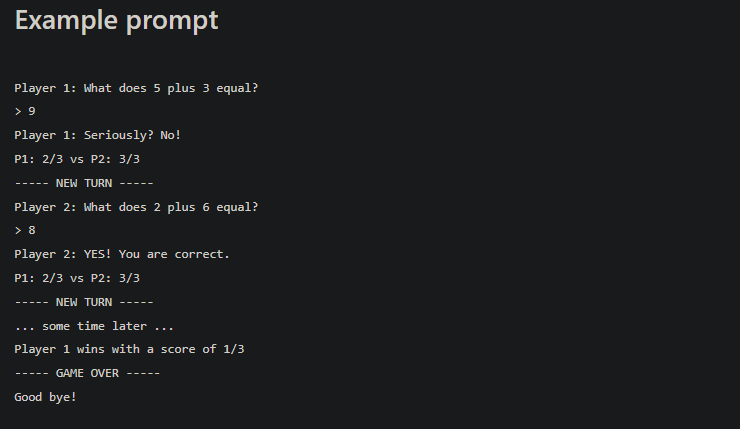

# TwO-O-Player-Math-Game

# Description

A multiplayer math game where players will take turns to answer simple math addition problems. A new math question is generated for each time. It will pick two random numbers between 1 and 20. A player must answer his question correctly or lose a life.

# Details

Both players will start with 3 lives. They lose a life if they answer wrong. At the end of every turn, the game displays the new scores for both players, so players know where they stand.

The game doesn’t end until one of the players loses all of their lives. At this point, the game announces who won and what the other player’s score is.

### Made by [Kayden](https://github.com/iKayden)
